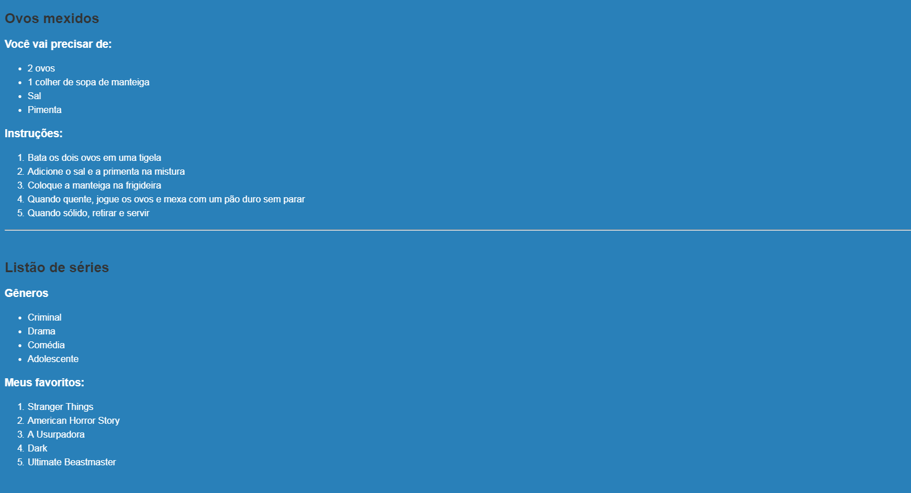

# Conteúdo das aulas do curso Eu ProgrAmo

## Exercícios
### Para Terça - 02/10/2018
1. Exercício de lista
2. Exercício Bloquinhos
3. FEEDBACK

#### Exercício de lista


Escolha uma receita ou uma lista de séries e faça uma lista não ordenada e ordenada. Experimente com os tipos de enumeração (ao invés de ser 1, 2, 3; tente colocar a, b, c ou i, ii, iii).


#### Exercício de Bloquinhos


Observe e reproduza a página com os blocos A, B, C, D utilizando html e css. Nesse exercício vcs vão utilizar as propriedades **display, margin, padding, entre outras**.  

Dica: vamos precisar usar a propriedade de border.
A propriedade _border_ recebe 3 valores: a grossura da borda, o estilo da borda (se é sólida, pontilhada etc), e a cor dela.
```css
div {
    border: 2px solid red;
}
```
Ver referência [aqui](https://www.w3schools.com/cssref/pr_border.asp).


#### FEEDBACK
Ver no email que vocês vão receber.

------

### Para Quinta - 04/10/2018
5. Leitura de artigos
6. Exercício Artigo Iana
7. [Projeto Cozinharia] HTML de Home, A Cozinharia, Eventos > Casamento, Eventos > Empresariais, Contato
8. Exercício Flexbox

#### Artigos
HTML5

https://www.devmedia.com.br/html-semantico-conheca-os-elementos-semanticos-da-html5/38065

https://www.w3schools.com/Html/html5_semantic_elements.asp

 Flexbox

 https://origamid.com/projetos/flexbox-guia-completo/

Responsividade

https://brasil.uxdesign.cc/o-que-%C3%A9-responsive-web-design-ab292eb616b7


#### Exercício Artigo

> Atenção! Talvez existirá um espaço em branco entre footer e o navegador.

#### Projeto Cozinharia em HTML
[Site online da Cozinharia no Habemus](http://projeto-cozinharia.habemus.website/index.html)

[Layout em pdf](https://drive.google.com/file/d/1T0uhK4d-c8wTCldaaq4JhCy3WOzfn5Hv/view)