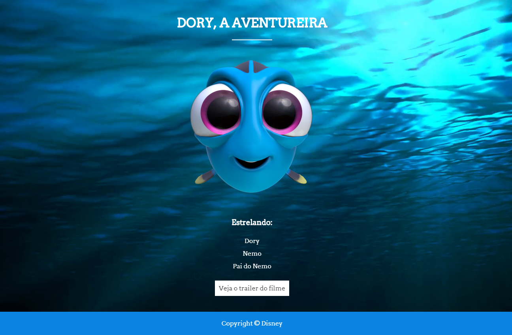
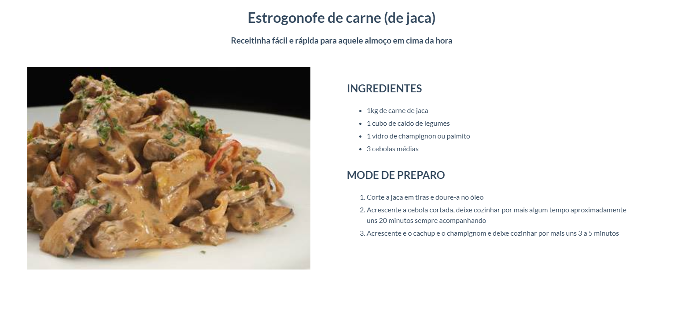
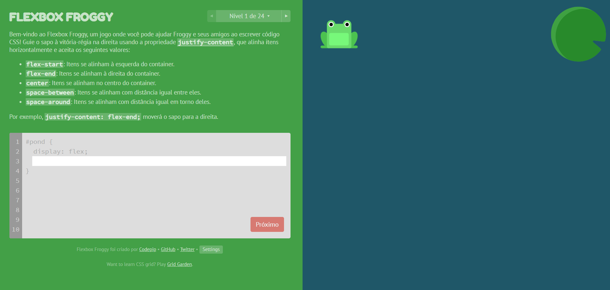

# Conteúdo das aulas do curso Eu ProgrAmo

## Exercícios
### Para Terça - 02/10/2018
1. Poster Dory
2. Exercício de lista
3. Exercício Bloquinhos
4. Estrogonofe de carne de jaca
5. FEEDBACK

#### Poster Dory - Referência


#### Exercício de lista


### Exercício de Bloquinhos

Dica: vamos precisar usar a propriedade de border.
A propriedade _border_ recebe 3 valores: a grossura da borda, o estilo da borda (se é sólida, pontilhada etc), e a cor dela.
```css
div {
    border: 2px solid red;
}
```
Ver referência [aqui](https://www.w3schools.com/cssref/pr_border.asp).

#### Estrogonofe de carne de jaca


#### FEEDBACK
Ver no email que vocês vão receber.

------

### Para Quinta - 04/10/2018
6. Ler artigos HTML5
7. Exercício Artigo
8. [Projeto Cozinharia] HTML de Home, A Cozinharia, Eventos > Casamento, Eventos > Empresariais, Contato
9. Exercício Flexbox

#### Artigos HTML5
https://www.devmedia.com.br/html-semantico-conheca-os-elementos-semanticos-da-html5/38065

https://www.w3schools.com/Html/html5_semantic_elements.asp

#### Exercício Artigo

> Atenção! Talvez existirá um espaço em branco entre footer e o navegador.

#### Projeto Cozinharia em HTML
> Em breve imagens do projeto

#### Exercício Flexbox
Flexfroggy: http://flexboxfroggy.com/#pt-br

Finalizar os 24 níveis.

